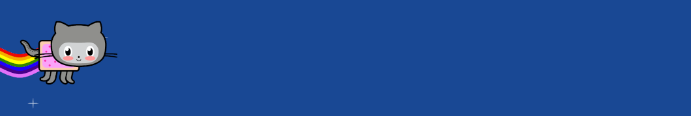

 

  <h1 align="center">✩&emsp;Welcome!&emsp;✩</h1>

### Hit there! I'm Tolga
I am Game Developer! If you wanna work with me, you can email me!

  <h3 align="center"> I'm Tolga, 💻 game developer from  <b> Turkey.</b>   Take a peek into my journey! 🚀 </h3>

 

📫 I’m currently making Uity especially on mobile games.  
📫 I’m looking to collaborate on Game Development. 
📫 How to reach me: Send an email to **orhan.konat.12@gmail.com**  
⚡ Fun fact: life is just another game. To win it, you should find your destination. 

![Git][git-shield]
![Unity][unity-shield]
![Rider][rider-shield]

  
  
  
  
  
  
  
  
  
  
  
  
  
  
  
  
  
  
  
  
  
  
  
  
  

  
  
  
  
  
  
  
  
  
  
          

  
![Rider][star-shield] 
 

[git-shield]: https://img.shields.io/badge/GIT-E44C30?style=for-the-badge&logo=git&logoColor=white
[unity-shield]: https://img.shields.io/badge/Unity-100000?style=for-the-badge&logo=unity&logoColor=white
[rider-shield]: https://img.shields.io/badge/Rider-000000?style=for-the-badge&logo=Rider&logoColor=white
[star-shield]: https://img.shields.io/github/stars/Tolga-dev?style=social
[stats-shield]: https://github-readme-stats.vercel.app/api/top-langs/?username=Tolga-dev&theme=blue-green

 
